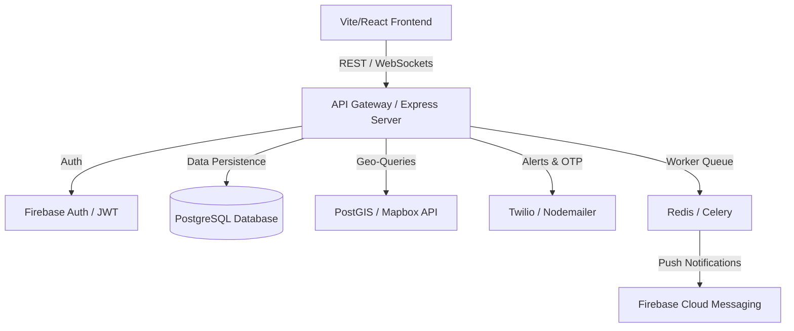

# 🩸 LifeLink: Smart Blood Bank & Donation Platform

LifeLink is a modern, high-fidelity React prototype of an end-to-end Smart Blood Donation Platform designed to bridge the gap between voluntary blood donors, patients/recipients in urgent need, and blood bank administrators.

This project is built using **React 19**, **TypeScript**, and **Vite**, featuring a clean, dark-themed glassmorphic user interface, micro-animations, and full client-side routing.

---

## 🚀 Prototype Architecture Overview

The prototype is built with a clean separation of concerns, hosting component markup and logic in [App.tsx](file:///f:/R%20Thousif%20Ahmed/Projects/Blood%20donor%20-%20prototype/my-app/src/App.tsx) and all layout and design styling consolidated in [App.css](file:///f:/R%20Thousif%20Ahmed/Projects/Blood%20donor%20-%20prototype/my-app/src/App.css). Key modules include:

1. **🔐 Multi-Role Authentication Screen ([AuthScreen](file:///f:/R%20Thousif%20Ahmed/Projects/Blood%20donor%20-%20prototype/my-app/src/App.tsx#L126))**:
   - Supports role selection (Donor, Recipient, and Admin) and seamless **Logout** redirection.
   - Features a styled OTP entry verification interface.
2. **🤲 Donor Dashboard ([DonorDashboard](file:///f:/R%20Thousif%20Ahmed/Projects/Blood%20donor%20-%20prototype/my-app/src/App.tsx#L259))**:
   - Displays donor statistics (Donations, Lives Saved, Days Since Last Donation).
   - Provides live eligibility indicators with visual pulse rings.
   - Shows local emergency requests and triggers an interactive **Confirm Donation Response Modal** to register commitments.
3. **🏥 Recipient Dashboard ([RecipientDashboard](file:///f:/R%20Thousif%20Ahmed/Projects/Blood%20donor%20-%20prototype/my-app/src/App.tsx#L355))**:
   - Includes a **City/Location Selector** supporting major cities (Bengaluru, Mumbai, Delhi, Hyderabad, Chennai, Pune, Kolkata, Ahmedabad) which auto-filters donors and centers the map dynamically.
   - Interactive proximity search displaying matching compatible donors sorted by distance.
   - Features a **Broadcast Emergency Request** system notifying matching donors.
4. **📋 Donor Registration & Screening ([RegisterDonor](file:///f:/R%20Thousif%20Ahmed/Projects/Blood%20donor%20-%20prototype/my-app/src/App.tsx#L528))**:
   - A multi-step flow capturing personal details, weight, and city.
   - An interactive 16-point medical screening checklist (evaluating chronic illnesses, recent surgeries, tattoos, etc.).
   - Computes instant medical eligibility based on strict clinical guidelines.
5. **⚙️ Admin Control Panel ([AdminDashboard](file:///f:/R%20Thousif%20Ahmed/Projects/Blood%20donor%20-%20prototype/my-app/src/App.tsx#L717))**:
   - Provides macro stats: Total Donors, Registered Recipients, Open Emergency Requests, Available Units.
   - Displays a live blood type inventory tracker with colored depletion indicator bars.
   - Handles a mock approval interface for pending donor/recipient accounts.
6. **🩸 Compatibility Engine ([CompatibilityView](file:///f:/R%20Thousif%20Ahmed/Projects/Blood%20donor%20-%20prototype/my-app/src/App.tsx#L808))**:
   - Interactive matrix mapping who can donate to and receive from specific blood types (highlighting universal donor/recipient configurations).

---

## 🛠️ How to Run the Prototype

To run the React + TypeScript + Vite project locally, make sure you have [Node.js](https://nodejs.org/) installed:

```bash
# Install dependencies
npm install

# Start the Vite development server
npm run dev
```

Once running, navigate to `http://localhost:5173` in your browser. You can log in as any role:
- **Donor**: Test the eligibility screen and view local requests.
- **Recipient**: Search for O+ blood in Bengaluru to see proximity matches.
- **Admin**: Monitor global inventory levels and review registrations.

---

## 🗺️ Roadmap to a Fully-Fledged Production App

Transitioning this high-fidelity prototype into a production-grade, HIPAA-compliant, real-time platform requires migrating the frontend to a distributed system and introducing a scalable backend database and services layer.



### Phase 1: Database Architecture (Relational & Geo-enabled)
To handle user relations, health records, requests, and geographical lookups, a relational database like **PostgreSQL** with the **PostGIS** extension is recommended.

#### Draft Database Schema (SQL)
```sql
-- 1. Users Table (Core identity)
CREATE TABLE users (
    id SERIAL PRIMARY KEY,
    name VARCHAR(100) NOT NULL,
    email VARCHAR(150) UNIQUE NOT NULL,
    password_hash VARCHAR(255) NOT NULL,
    role VARCHAR(20) CHECK (role IN ('donor', 'recipient', 'admin')) NOT NULL,
    phone VARCHAR(20) UNIQUE NOT NULL,
    city VARCHAR(100),
    latitude DOUBLE PRECISION,
    longitude DOUBLE PRECISION,
    geom GEOMETRY(Point, 4326), -- Geospatial indexing for distance queries
    created_at TIMESTAMP DEFAULT CURRENT_TIMESTAMP
);

-- 2. Donors Table (Medical & Eligibility data)
CREATE TABLE donors (
    user_id INT PRIMARY KEY REFERENCES users(id) ON DELETE CASCADE,
    blood_group VARCHAR(5) CHECK (blood_group IN ('A+', 'A-', 'B+', 'B-', 'AB+', 'AB-', 'O+', 'O-')) NOT NULL,
    age INT NOT NULL,
    weight INT NOT NULL,
    gender VARCHAR(10),
    last_donated_date DATE,
    eligibility_status BOOLEAN DEFAULT TRUE,
    next_eligible_date DATE,
    medical_screening_json JSONB -- Stores responses to the 16-point checklist
);

-- 3. Emergency Requests Table
CREATE TABLE emergency_requests (
    id SERIAL PRIMARY KEY,
    recipient_id INT REFERENCES users(id) ON DELETE CASCADE,
    patient_name VARCHAR(100) NOT NULL,
    blood_group VARCHAR(5) NOT NULL,
    hospital_name VARCHAR(255) NOT NULL,
    units_needed INT DEFAULT 1,
    urgency VARCHAR(20) CHECK (urgency IN ('Critical', 'Urgent', 'Normal')) NOT NULL,
    status VARCHAR(20) DEFAULT 'Open' CHECK (status IN ('Open', 'Fulfilled', 'Expired')),
    latitude DOUBLE PRECISION NOT NULL,
    longitude DOUBLE PRECISION NOT NULL,
    created_at TIMESTAMP DEFAULT CURRENT_TIMESTAMP
);

-- 4. Responses & Broadcasts (Tracking matches and communication)
CREATE TABLE broadcasts (
    id SERIAL PRIMARY KEY,
    request_id INT REFERENCES emergency_requests(id) ON DELETE CASCADE,
    donor_id INT REFERENCES users(id) ON DELETE CASCADE,
    notified_at TIMESTAMP DEFAULT CURRENT_TIMESTAMP,
    status VARCHAR(20) DEFAULT 'Sent' CHECK (status IN ('Sent', 'Accepted', 'Rejected', 'Completed'))
);
```

### Phase 2: Backend REST APIs & Real-time Integrations
Develop a robust API backend (Node.js/Express, Python/FastAPI, or NestJS) to replace static arrays:
- **Authentication**: Migrate to Firebase Auth or standard JSON Web Tokens (JWT) with secure HttpOnly cookies.
- **Geospatial Queries**: Replace the prototype's mock distances with actual SQL distance queries:
  ```sql
  -- Find donors within 10km of a hospital
  SELECT user_id, ST_Distance(geom, ST_MakePoint(hospital_lon, hospital_lat)::geography) / 1000 AS distance_km
  FROM users u
  JOIN donors d ON u.id = d.user_id
  WHERE ST_DWithin(geom, ST_MakePoint(hospital_lon, hospital_lat)::geography, 10000)
    AND d.eligibility_status = TRUE;
  ```
- **Real-Time Notification Pipeline**:
  - Integrate **WebSockets (Socket.io)** for instant push notifications to active donor dashboards when a recipient broadcasts an emergency request.
  - Implement a background task worker queue (e.g., **BullMQ** or **Celery** with Redis) to process broadcasts asynchronously.

### Phase 3: External Communications & Third-Party APIs
- **SMS Gateway**: Integrate **Twilio** or **AWS SNS** to send immediate SMS broadcasts to offline compatible donors in the immediate vicinity.
- **Maps & Geocoding**: Incorporate the **Google Maps SDK** or **Mapbox GL JS** to calculate actual travel times and display live routing paths between the donor and hospital.
- **OTP Verification**: Move from simulated OTPs to production verification using Twilio Verify API.

### Phase 4: Regulatory, Security & Compliance
- **HIPAA & GDPR Compliance**: Personal health screening data (recorded in [RegisterDonor](file:///f:/R%20Thousif%20Ahmed/Projects/Blood%20donor%20-%20prototype/my-app/src/App.tsx#L528)) must be encrypted at rest and in transit (using AES-256). Ensure strict role-based access control (RBAC) so that recipients never see detailed medical histories of donors, only their availability status.
- **SSL/TLS Encryption**: Force HTTP Strict Transport Security (HSTS).

### Phase 5: Mobile App Port (iOS & Android)
Since blood donation requests are time-sensitive, native push notifications and background geolocation tracking are essential.
- Port the React components to **React Native** or **Expo** for cross-platform iOS and Android deployment.
- Integrate **Firebase Cloud Messaging (FCM)** and Apple Push Notification service (APNs) for high-delivery notification channels.

---

## 🎨 UI/UX Design System Guidelines

If you expand or style the app further, please adhere to our premium design system established in [App.css](file:///f:/R%20Thousif%20Ahmed/Projects/Blood%20donor%20-%20prototype/my-app/src/App.css) and [index.css](file:///f:/R%20Thousif%20Ahmed/Projects/Blood%20donor%20-%20prototype/my-app/src/index.css):
- **Font Stack**: `Playfair Display` (for headers) paired with `DM Sans` (body) and `DM Mono` (statistics/badges).
- **Color Palette**:
  - Primary Background: `#080C10` (Midnight Black)
  - Card Overlays: `rgba(255,255,255,0.03)` with a `1px solid rgba(255,255,255,0.08)` border.
  - Accent Red: `#FF3B3B` (Blood Group Badges, Primary actions)
  - Accent Pink: `#C62A88` (Registration flows, secondary alerts)
  - Success Green: `#00C853` (Eligible indicators, completed status)
